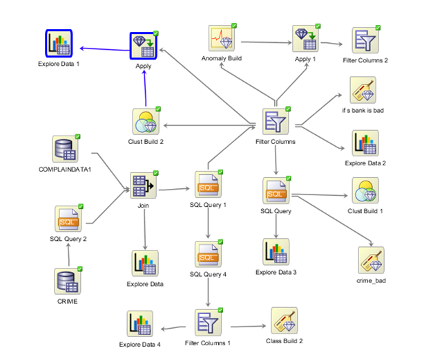
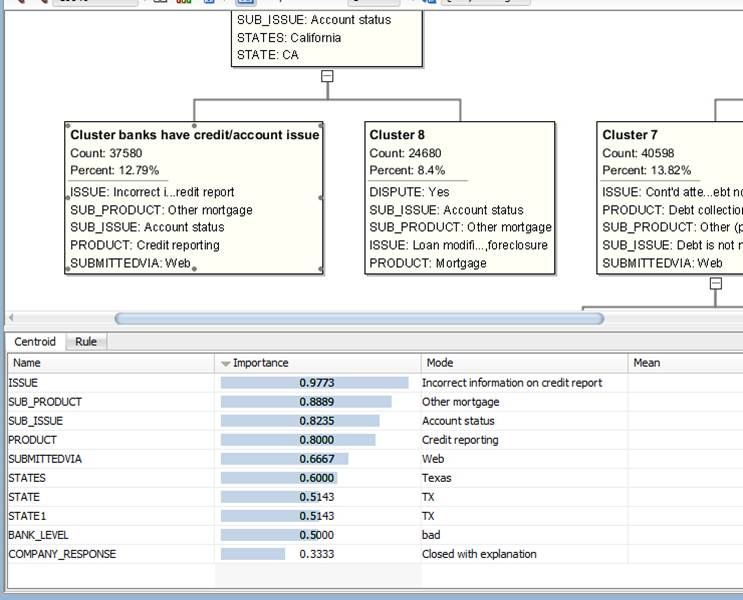
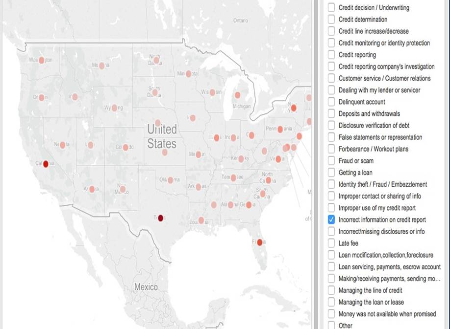
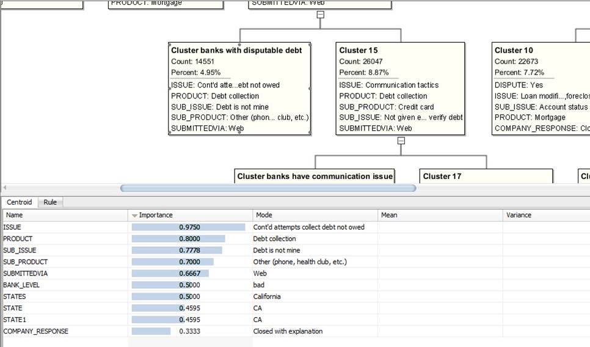
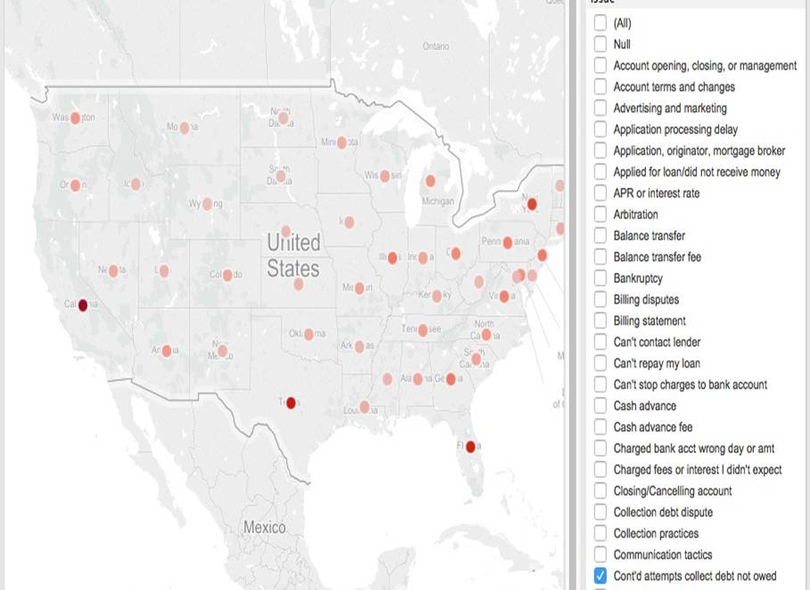
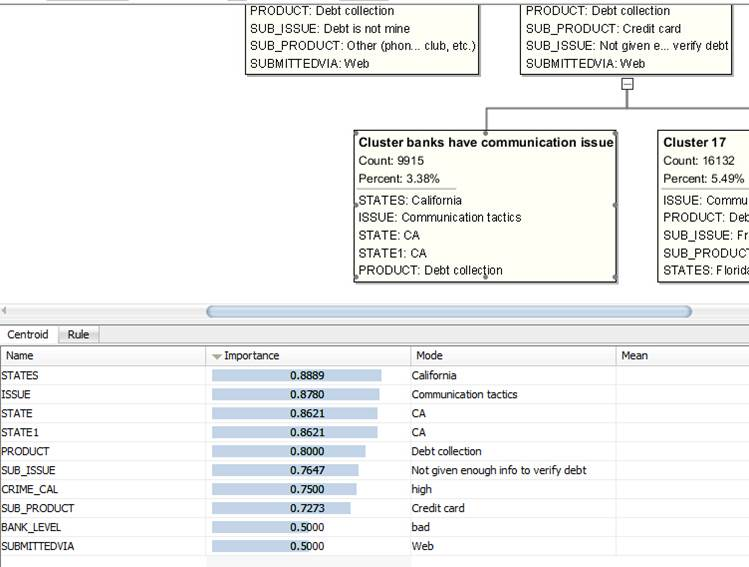
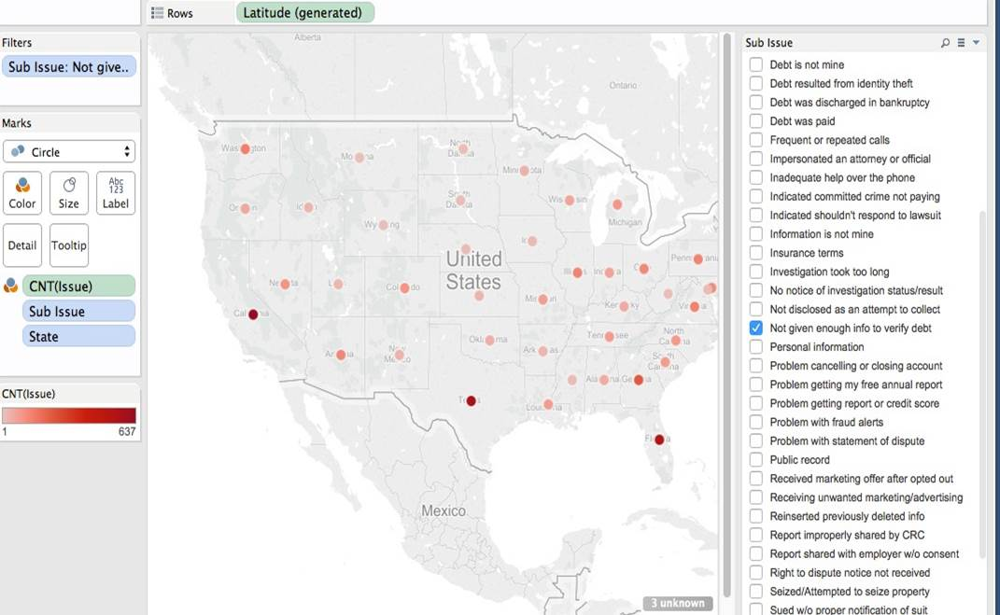
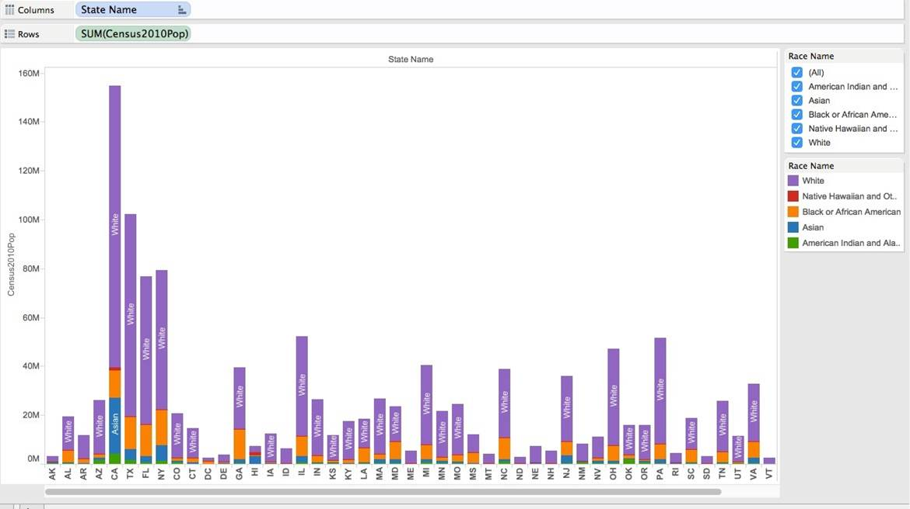
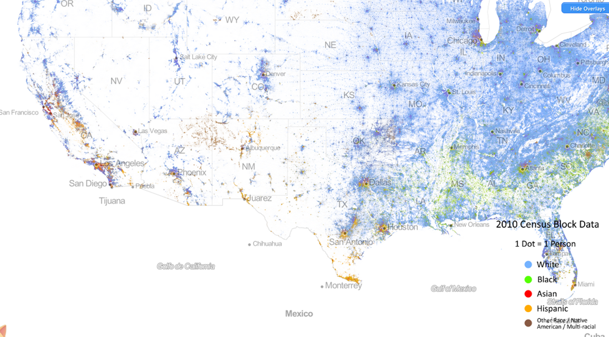
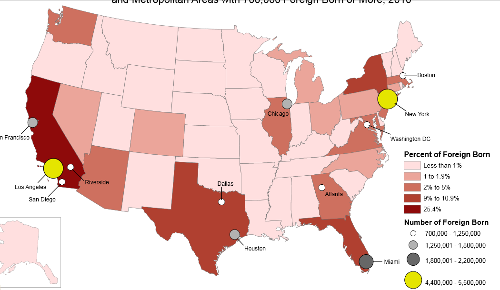

Data Science Fall 2014 Presentation
===

##Datasets

1. Crime rates states
2. Finacial consumer complaint
3. Crime rates on zip code level
4. Census

##Findings

###First Try

At first we were trying to find the relationship between bad bank (we define bank that doesn’t not respond timely, has disputation and sub-issues as bad bank) and crime rate.

What we want to prove is: bad bank usually located in high crime rate places

It turns out we were wrong after using the crime rate on zip code level

###Second Try

After the failure of the first try, we decide to change our dataset, then we chose the Financial Consumer Complaint dataset.

Overview of the workflow

We used cluster on Financial consumer complaint dataset
What we found:

**1**

#### Banks that have credit/account issues are more likely located in TX

**Cluster:**

**Tableau**

we used filter on "Issue" column and select only "Incorrect information on credit report"

**2**

#### Banks that have disputable debts are more likely located in CA

**Cluster:**

**Tableau**

we used filter on "Issue" column and select only "Con't attempts collect debt not owed"

**3**

#### Banks that have communication issues are more likely located in CA

**Cluster:**

**Tableau**

we used filter on "Sub issue" column and select only "Not given enough info to verify debt"

##Asumption

###Why CA has highest number of communication problems? 

We think language could be the problem, like people whose first language is not English, they may have problem communicate with others in English.

###Verify Using Tableau

We used race data in census dataset and found out CA has the largest diversity and has relatively large amount of people whose first language is not English.

People tend to use their first language to communicate with their own race.

**Shelves**
Rows: states
Column: sum of the population from Census of 2010

**Marks**
The mark type is Bar

**Labels**
The bars are labeled by races in different colors

###Verify using online sources

We find some online sources about the race distribution in US

###Another thought

We later thought migration population may have bigger communication problem than races. We searched some onlie source:

